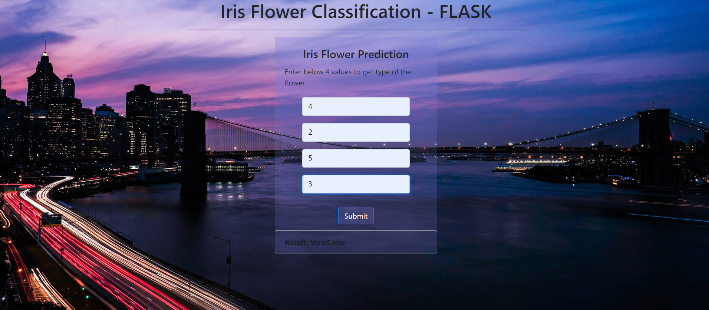

# IrisFlask-ML
Its as Responsive WebApp Demonstrating Basic IRIS Flower Classification - FLASK

## Steps
-  To deploy the project in Heroku we need to create __Procfile__ and below loc
    -  web: gunicorn app:app
    -  Explanation: first app is the module name and second app is the flask python script i.e app.py
-  While deploying the app in heroku I got this issue __at=error code=H10 desc="App crashed" method=GET path="/favicon.ico"__ I was getting this issue because I am using Bootstrap, its an issue related to it, fix is as below
    -  npm install jquery --save
    -  npm install popper.js --save
    -  npm install serve-favicon --save

